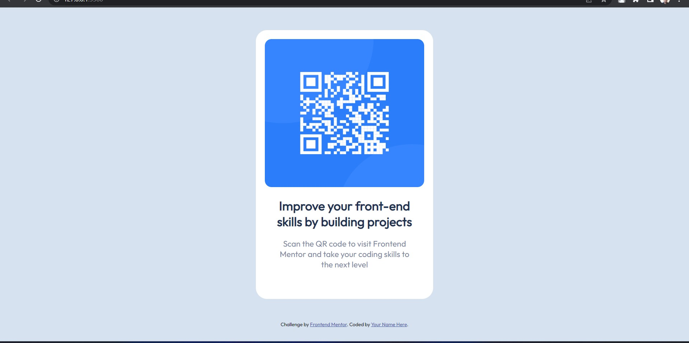
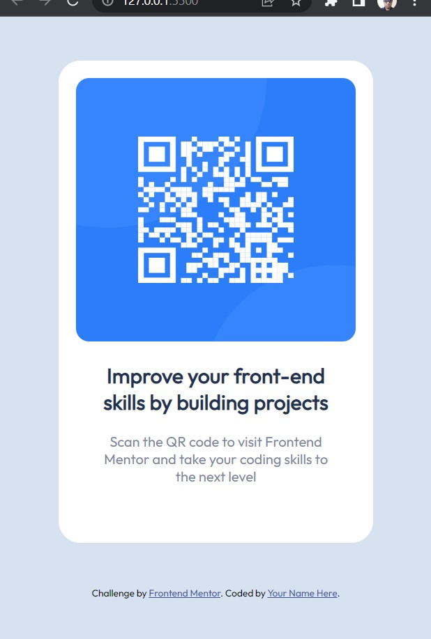

# Frontend Mentor - QR code component solution

This is a solution to the [QR code component challenge on Frontend Mentor](https://www.frontendmentor.io/challenges/qr-code-component-iux_sIO_H). Frontend Mentor challenges help you improve your coding skills by building realistic projects. 

## Table of contents

- [Overview](#overview)
  - [Screenshot](#screenshot)
- [My process](#my-process)
  - [Built with](#built-with)
  - [What I learned](#what-i-learned)
  - [Continued development](#continued-development)
  - [Useful resources](#useful-resources)
- [Author](#author)

## Overview

### Screenshot


<p align="center">
  
</p>

## My process

### Built with

- HTML5 markup
- CSS properties

### What I learned

I learn a little bit about media query

```css
@media only screen and (max-width: 500px) {
    .scanner-container{
        width: 361px;
        height: 554px;
    }
    
    .scanner-image{
        width: 321px;
        height: 303px;
    }
    
    .scanner-details{
        font-size: 18px;
    }
}
```

### Continued development

will be learn about dry and how to use it and also more about responsive web development and responsive UI/UX designing.

### Useful resources

- [w3schools](https://www.w3schools.com/css/css_rwd_mediaqueries.asp)
- [csstricks](https://css-tricks.com/a-complete-guide-to-css-media-queries/)


## Author

- Name : Suraj Sharma
- Github : [surajsharma19](https://github.com/surajsharma19)
